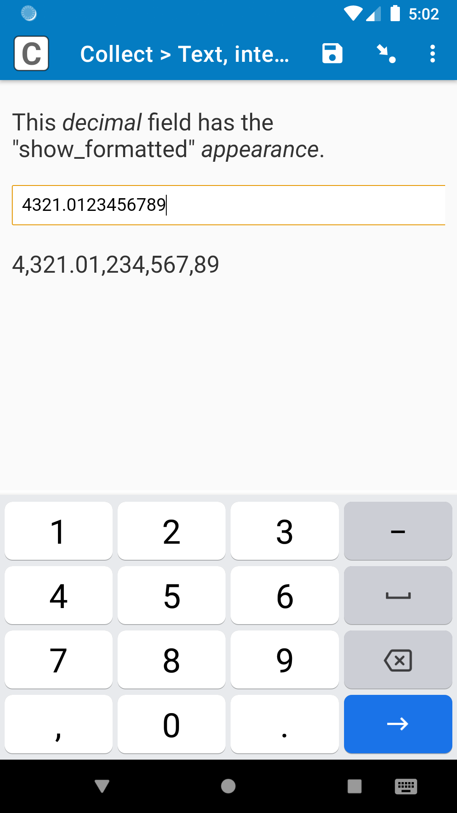

# Text, integer, decimal

||
|:---:|
|*Decimal* field with "show_formatted" *appearance*|

## Description

A simple replacement for *text*, *integer*, and *decimal* fields. This can be used with all three field types, so you don't have to use a different field plug-in for each field type. You can use this either for the extended functionality (see [features](#features) below), or you can use it as a starting template when creating your own field plug-in for all three of these field types.

### Features

In addition to supporting the default SurveyCTO features listed below, this field plug-in offers the following expanded functionality:

1. **Support for HTML in field references**  
    If you reference another field's value in either the field *label* or *hint*, and that referenced value contains HTML, the HTML will be correctly rendered.
1. **Better support for RTL languages**  
    The field label, hint, and input will now be justified to the right when they contain an RTL language.

This field plug-in also has a text box that expands to fit its contents, just like the [text-box](https://github.com/surveycto/text-box/blob/main/README.md) field plug-in.

## Requirements

For full use of all features on Android, Android 7 or up is required. However, the field plug-in will still work well on older versions of Android. Here is a list of limitations on older versions of Android:

* Different appearances ("numbers", "numbers_decimal", and "numbers_phone") and *integer* and *decimal* fields will not display the correct keyboard. However, the fields will ensure only the correct characters can be entered (e.g. only integers).
* The field for data entry will not completely expand to fit all content, but it will be close, within a few pixels.

Because web browsers and iOS devices are kept more up-to-date with the latest features, nearly all web browsers and iOS devices should support the field plug-in, but test it on your collection device beforehand to be sure.

## Data format

The data format will be text for *text* fields, and numbers for *integer* and *decimal* fields.

## How to use

### Getting started

**To use this plug-in as-is**, just download the [text-integer-decimal.fieldplugin.zip](https://github.com/surveycto/text-integer-decimal/raw/main/extras/test-form/Text%2C%20integer%2C%20decimal%20test%20form.xlsx) file from this repo, specify this field plug-in as a custom field appearance in the form design (like in the [test form](https://github.com/surveycto/text-integer-decimal/raw/main/extras/test-form/Text%2C%20integer%2C%20decimal%20test%20form.xlsx)), and attach it to your form. For more details about using field plug-ins, please read the [user documentation](https://docs.surveycto.com/02-designing-forms/03-advanced-topics/06.using-field-plug-ins.html).

**To create your own** field plug-in using this as a template, follow these steps:

1. Fork this repo
1. Make changes to the files in the `source` directory.  
    * **Note:** be sure to update the `manifest.json` file as well.
1. Zip the updated contents of the `source` directory.
1. Rename the .zip file to *yourpluginname*.fieldplugin.zip (replace *yourpluginname* with the name you want to use for your plug-in).
1. You may then attach your new .fieldplugin.zip file to your form as normal.

For more information about developing your own field plug-ins, please read the [developer documentation](https://github.com/surveycto/Field-plug-in-resources).

### Default SurveyCTO feature support

| Feature / Property | Support |
| --- | --- |
| Supported field type(s) | `text`, `integer`, `decimal`|
| Default values | Yes |
| Constraint message | Uses default behavior |
| Required message | Uses default behavior |
| Read only | Yes *(shows the current value, if present)* |
| media:image | Yes |
| media:audio | Yes |
| media:video | Yes |
| `numbers` appearance | Yes (`text` only) |
| `numbers_decimal` appearance | Yes (`text` only) |
| `numbers_phone` appearance | Yes (`text` only) |
| `show_formatted` appearance | Yes (`integer` and `decimal` only) |

### Parameters

**Note about the keyboard on iOS:**  
iOS has a less-consistent way of determining which on-screen keyboard to display than Android. If you plan on using this field plug-in on iOS, you should test your form on the actual iOS device that you plan on using. If the wrong keyboard appears (for example, if there is no minus button available), you may supply an optional parameter to the plug-in to set the keyboard type manually.

| Parameter key | Parameter value |
| --- | --- |
| `inputmode-ios`, `inputmode-android`, `inputmode-web` (all optional) | Possible values: `none`, `text`, `decimal`, `numeric`, `tel`, `search`, `email`, `url`. [Click here for more information about the inputmode attribute.](https://css-tricks.com/everything-you-ever-wanted-to-know-about-inputmode)|

While the `inputmode-ios` parameter is the most important, you can also use the `inputmode-android` and `inputmode-web` parameters to change the keyboard for that field in Android and web forms, respectively.

## More resources

* **Test form**  
This form will help you view the field plug-in with different field types and *appearance*s.  
[Download test form](https://github.com/surveycto/text-integer-decimal/raw/main/extras/test-form/Text%2C%20integer%2C%20decimal%20test%20form.xlsx)

You can also use the test forms for the [baseline-text](https://github.com/surveycto/baseline-text/blob/master/README.md), [baseline-integer](https://github.com/surveycto/baseline-integer/blob/master/README.md), and [baseline-integer](https://github.com/surveycto/baseline-integer/blob/master/README.md) field plug-ins. Just be sure to update the name of the field plug-in in the *appearance* of each field (e.g. change "baseline-text" to "text-integer-decimal").

* **Developer documentation**  
Instructions and resources for developing your own field plug-ins.  
[https://github.com/surveycto/Field-plug-in-resources](https://github.com/surveycto/Field-plug-in-resources)

* **User documentation**  
How to get started using field plug-ins in your SurveyCTO form.  
[https://docs.surveycto.com/02-designing-forms/03-advanced-topics/06.using-field-plug-ins.html](https://docs.surveycto.com/02-designing-forms/03-advanced-topics/06.using-field-plug-ins.html)
